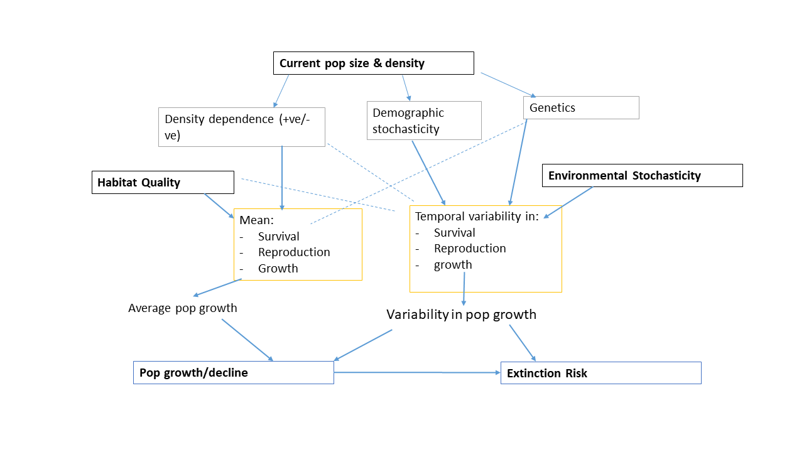
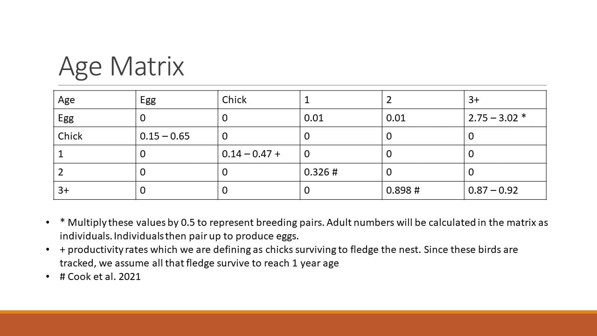

```{r setup, include=FALSE}
knitr::opts_chunk$set(echo = TRUE)
```

## Demographic Curlew Population Model  
\  
The aim is to design a population model for curlew across the island of Ireland, and then use the predicted population output to determine population viability under a number of designed scenarios when head-starting is implemented.  
Given the complexity of life stages within curlew - predominantly survival rates and reproductive input (eggs, pre-fledged young have a lower survival rate than adults; curlew have the potential to breed from age 1: the numbers are unknown but expected to be low, with regular breeding more typically occurring around age 3) - we will define a structured (age-based) population and build a demographic PVA.  
  
Initially - as seen in the example code below - we use a simple two-stage matrix population model to calculate annual population growth rate. A Ricker model (density dependence) was used to simulate population growth (on the advice of Steffen Oppel and from lecture notes from Kevin Shoemaker and his excellent population modelling lecture series).  
We represented stochastic variation by including a value of 10% variation around the annual population growth rate. This is applied within the Ricker equation.  
Carrying capacity was based on population numbers from surveys conducted in the 1980's (estimated to be around ) 

## Factors affecting population viability  
  
Factors that affect population growth and viability (Morris & Doak, 2002)  
  
 
```{r factors_pva, echo = FALSE, fig.cap = "Figure 1. A simple breakdown of factors that can affect population viability as taken from Morris and Doak (2002)."}


```


\  
  

##

### Load libraries  
  
This code will use the **popbio** package for calculating population projections. In particular the _pop.projection_ function

```{r libraries, message  = FALSE, results = FALSE}
libs <- c("popbio",
          "doParallel",
          "foreach",
          "tidyverse",
          "markdown",
          "rmarkdown",
          "knitr",
          "data.table")

lapply(libs,
       require,
       character.only = TRUE)

```
\  
  


## Parameters Used  
\  
The parameters - values obtained from literature and discussions within the steering group - can be changed depending upon the scenario. For several parameters, we have a range of values (e.g. productivity rate for curlew is between 0.14 - 0.47). If we can obtain more definitive values, then we could reduce the range for each parameter, or have a fixed value.  

_Initial population values_:  
The literature and reports used to obtain current population numbers report curlew in breeding pairs. Thus, all of these values will need to be multiplied by 2 at the start of the model as the matrix calculates individuals and not breeding pairs.  
Literature: Cook et al., 2021; Colhoun et al., 2015; Grant et al., 1999; O'Donaghue et al., 1999; Booth-Jones et al., 2020; Taylor & Dodd 2013; Irish Breeding Bird EIP; 
- NI
  - specific sites within NI for more localised models
- ROI
  - less clear data on localised curlew records outside of Lough Nee and Corrib
  
\
_Survival Rates_:  
The survival rates were obtained from literature (Grant et al., 1999; Cook et al., 2021; Kelly Curlew Action Group so far). As we are building a 5-stage matrix, we need the survival rates of eggs to hatching, chicks to fledging, 1st year survival, 2nd year survival, 3+ (or adult) survival rates.  
Extra calculations within the matrix model:
 - adult reproducivity will be multiplied by 0.5 to represent the fact that not all of the individuals lay eggs. We are assuming a 1:1 sex ratio across our populations, thus this halving of the number eggs can be interpreted as breeding pairs.  
 - philopatry probability, a proportion of 1st year fledglings (or even 2 year olds that have not yet had first breeding) have the chance of not returning to the released/breeding site, thus lowering the total population again. Therefore, we will need to add in a proportional multiplier to the 1st year survival values to simulate birds that have not returned. This is explained further down below.  

_Productivity Rates_:  
As above, productivity rates were obtained from the literature and the range of values was discussed with the steering group. These values can be seen in the excel spreadsheet "CurlewPVA_parameters_v2.xlsx", along with the cited literature and comments.

\

## Obtain combinations of parameters  
  
As many of our parameters have ranges of values, we need to create a table that lists all combinations.  These will then be looped over one at a time within the model itself. Each single combination will be re-run 500 times given the in-built stochasticity within the model.  
Below are ten examples pulled from the combinations table for a simple two-stage matrix.  
  
```{r param_combos, echo = FALSE}
NI.pop.sizes    <- seq(250, 560, 10)      # NI pop range from 250 - 500 
                                          # with 10 pair intervals

ROI.pop.sizes   <- seq(100, 200, 10)      # ROI pop range

I.popsizes      <- seq(100, 560, 20)      # all ireland pop size

S.ad            <- seq(0.60, 0.92, 0.02)  # adult survival
                                          # rates obtained from literature
                                          # using UK wide rates
                                          # NEED TO OBTAIN EU RATES

S.jw            <- seq(0.14, 0.49, 0.02)  # Juvenile survival - chick to
                                          # fledging. UK wide. GET EU Numbers

S.jc            <- seq(0.20, 0.55, 0.02)  # SO suggested fledge survival rates
                                          # (prod) were too low, so try with 
                                          # a separate age class of released 
                                          # chicks, with assumed higher
                                          # survival

prod.rates     <- seq(0.14, 0.50, 0.02)  # productivity = number of fledged
                                          # chicks per pair

released        <- seq(10, 50, 10)        # the number of birds to be
                                          # introduced into the pop each year

intro.years     <- seq(3, 10, 1)            # the number of years in which
                                          # birds will be introduced


# Specify parameters for Pop Viability Analysis
n.years   <- 30                           # number of years to simulate
n.reps    <- 1                          # number of simulations
K         <- 5000                         # carrying capacity of site
capt.fail <- 0.10                         # proportion of captive birds failed
                                          # this is prior to release in the
                                          # wild


# Specify parameters for stochastic components of the PVA
SD.lambda   <- 0.10                       # estimate lambda for pop growth rate
                                          # SD allows for building 
                                          # uncertainty into the model

phil.p      <- 0.05                       # probability that birds don't return
                                          # to release/breeding site 
                                          # currently unknown, so make estimate

return.p    <- 0.95                       # this might not be needed as it is 
                                          # a philopatric trend, so once a 
                                          # bird has bred at a site, it shows
                                          # fidelity

catastrophe.p <- 0.001                    # simulate potential for collapse of 
                                          # population due to catastrophic 
                                          # event
catastrophe.i <- 0.25                     # impact of catastrophe on pop
                                          # i.e. prop of surviving birds
                                          # should we differentiate impact 
                                          # between adults and juvs?

breed.fail    <- 0.1                      # prob the breeding season is a 
                                          # complete failure
                                          # it might be possible to find this
                                          # in lit and assign real number

extinct.cutoff  <- c(10, 20, 50, 100)     # below this number, pop is extinct
acceptable.risk <- 0.1                    # risk considered acceptable to 
                                          # managers

sex.ratio <- c(1)     

simul.in <- expand.grid(I.popsizes,
                        S.ad,
                        S.jw,
                        prod.rates) 

names(simul.in) <- c("pop.size",
                     "S.ad",
                     "S.jw",
                     "Productivity Rate (F)")

set.seed(12345)  
data <- dplyr::sample_n(simul.in, 10)
data

```
  
\  

  
## The matrix model and multiplication  
  
  I initially began trialling the code using a simple 2-stage matrix (see below), with just chick and adult productivity. However, upon further investigation and through discussions with Gillian and David, we are moving to a 5-stage age matrix: *eggs*, *chicks*, *1st year*, *2nd year*, *adult (3+)*.  
This is due to survival rates being different across each of those stages, with egg predation and destruction, chick predation, and varying survival rates once birds have fledged. 
The below code is producing a simple example, where I have inserted a specific value in each cell (this is due to matrices in R not being able to accept non-numeric values, so it would not show the values 0.14 - 0.47).  

  
```{r pva_age_matrix}
matrix(c(0, 0.2, 0, 0, 0,
              0, 0, 0.2, 0, 0,
              0.01, 0, 0, 0.326, 0,
              0.01, 0, 0, 0, 0.898,
              3, 0, 0, 0, 0.90),
            nrow = 5,
            ncol = 5,
            dimnames = list(c("egg",
                              "chick",
                              "First Yr",
                              "Second Yr",
                              "Adult"),
                            c("egg",
                              "chick",
                              "First Yr",
                              "Second Yr",
                              "Adult")))

```
\  
  
Here is the matrix populated with the range of values which will be utilised within the model.  
  
```{r matrix_full_values, echo = FALSE, fig.cap = "Matrix values with ranges of values shown where they will be used in the model"}


```
  
\
The matrix will then be multiplied by a vector containing the starting population values for each age class. In the base model, I have been playing around with this being 100% adults or a 2:1 adult:chick split as following Steffen's example.
I believe we will have to use 100% adults for the base model, as our population numbers once again only specify breeding pairs - not a adult-chick-egg breakdown.  


## The probability of philopatry  
  
A key issue is the return of released and 1st year birds returning to within a set boundary of their breeding site. At the moment, we do not know how many return at that age or for their first breeding season. Once a bird has bred at a site, the site fidelity is reported to be high. So it is important that we include a probability of not returning in the early stages of a birds life. This will be represented in the matrix model by multiplying the survival of the birds by a value between 0 and 1 to represent this reduced number. Similar to

  
\

## Using the Ricker model - or which population model should we use
  
The Ricker model was used to extrapolate population size. This model incorporates density dependence - although depending on site, this may not be an issue that curlew in our scenarios need to contend with. For example Glenwherry formerly held thousands of breeding pairs and is now down to potentially 250. This suggests there is a lot of available habitat to use, so a growing population would not start to have detrimental effects until it reaches a much greater size. However, other areas, such as sites in RoI may be more susceptible to density dependent effects of population growth.  

The Ricker model:
$$
N_{t+1} = N_{t}e^{r(N_{t}/K)}
$$

This model uses the previous year's curlew numbers to calculate the next year's numbers.  
It multiplies the previous year population size by a value of population growth rate, $r$. This value is randomly selected from a normal distribution with mean = R.max and standard deviation SD.lambda.
We have set SD.lambda = 10% to represent stochasticity in the population growth rate.
R.max is calculated within the *pop.projection* function of the _popbio_ package.  
  
```{r ricker_model}
Ricker <- function(prev.abund) {
  
  prev.abund * exp(log(rnorm(1,             # rnorm is a function within R 
                             R.max,         # which calls a random value
                             SD.lambda))    # from a normal dist with:
                   * (1 - (prev.abund/K)))  # mean = R.max
                                            # sd   = SD.lambda
}

```
\  
  

## The Population model function  
  
The PVA function calculates population size for y years, utilising all of the values above. 
The model is structured with nested loops. The principle loop takes a single combination of values and then uses the *pop.projection* function from the _popbio_ package to calculate y years worth of population change. It also returns the stable growth rate ($\lambda$) "R.max", and the proportion of individuals within each age class. I also ask for it to return the $\lambda$ for each year, in case there is fluctuation.  
The PVA function also includes a scenario of a catastrophe causing a population collapse. The probability that this catastrophe occurs is 0.1% per year, and reduces the population to 25%.  
In order to account for years with poor breeding or breeding failure, we assumed breeding failure to occur with a probability of 10%.  

The second loop is the number of repetitions that each single combination of parameters is run for. So for each of the above 10 combinations, they would be run 500 times (for example).
This accounts for the stochastic nature of the population growth.  
  

```{r pva_function}
PVA <- function(
  n.reps,           # number of repetitions of single combination of params
  n.years,          # number of years to project populations
  init.N,           # starting population size
  K,                # carrying capacity of site
  catastrophe.p,    # prob(catastrophe) = 0.001
  catastrophe.i,    # catastrophe reduces pop to 25%
  F.loop,           # obtained from simul.in = prod.rate
  S.jw.loop,        # juvenile survival rate
  S.ad.loop,        # adult survival rate
  breed.fail        # prob(breeding failure) = 0.1
) {
  
  # Create array to store population values
  # rows = years, cols = reps
  Pop.Array <- array(0,
                     dim = c((n.years + 1),
                             n.reps))
  
  # Start loop of reps
  for (rep in 1:n.reps) {
    
    # initial abundance minus number of head-start birds
    # but we will have a seq of head-starting scenarios, so won't need
    # to select from a poisson distribution
    Pop.Array[1, rep]   <- init.N*2 #- rpois(1, capt.fail * init.N)
    
    # Loop through the years
    for (y in 2:(n.years + 1)) {
      
      # Check if ruined breeding season due to weather/disturbance/etc...
      # Possibly count number of poor breeding years in survey data and
      #   obtain a more accurate probability fo this occurring
      # f.loop comes from simul.in table
      F.Year <- ifelse(rbinom(1, 1, breed.fail) == 1,
                       F.loop * 0.5, 
                       F.loop)
      
      # Assign values to the characters used in the matrix expression
      bird.vr <- list(prod.rates = F.Year,
                      S.ad = S.ad.loop,
                      S.jw = S.jw.loop #,
                      # sx.r = sex.ratio
                      )

      # matrix calculations
      a <- matrix(sapply(bird.matrix,
                         eval,
                         bird.vr,
                         NULL),
                  nrow = sqrt(length(bird.matrix)),
                  byrow = TRUE)
      
      
      pop.size  <- c(0, (init.N*2))  # 0 chicks, all adults 
                        # had to multiply init.N by 2 to calculate total 
                        # number of individual adults - not breeding pairs
      
      # This is the popbio function that calculates populations
      projections <- pop.projection(a,
                                    n = pop.size,
                                    iterations = 30)
      
      #----- Stochastic Ricker Model  -----
      
      R.max <- projections$lambda      # max growth rate (max lambda)
      
      # stochasticity & density dependence
      
      # calculate abundance based on Ricker model
      # - rounded to integer, set to min of 0
      next.year <- max(0, 
                       trunc(Ricker(Pop.Array[y-1, rep])))
      
      # Catastrophe - check prob and then calculate impact on pop
      if(runif(1) < catastrophe.p) next.year <- next.year * catastrophe.i
      
      # catastrophe when in release program
      # if(y < intro.years) next.year <- next.year + init.N
      
      # Obtain year abundance
      Pop.Array[y, rep] <- next.year
      
    }
    
  }
  
  # Return
  return(Pop.Array)
  
}


```
  
  
```{r plot_pop_preds, echo = FALSE, results = FALSE}
libs <- c("popbio",
          "doParallel",
          "foreach",
          "tidyverse",
          "markdown",
          "rmarkdown",
          "knitr",
          "data.table")

lapply(libs,
       require,
       character.only = TRUE)

NI.pop.sizes    <- seq(250, 560, 10)      # NI pop range from 250 - 500 
                                          # with 10 pair intervals

ROI.pop.sizes   <- seq(100, 200, 10)      # ROI pop range

I.popsizes      <- seq(100, 560, 20)      # all ireland pop size

S.ad            <- seq(0.60, 0.92, 0.02)  # adult survival
                                          # rates obtained from literature
                                          # using UK wide rates
                                          # NEED TO OBTAIN EU RATES

S.jw            <- seq(0.14, 0.49, 0.02)  # Juvenile survival - chick to
                                          # fledging. UK wide. GET EU Numbers

S.jc            <- seq(0.20, 0.55, 0.02)  # SO suggested fledge survival rates
                                          # (prod) were too low, so try with 
                                          # a separate age class of released 
                                          # chicks, with assumed higher
                                          # survival

prod.rates     <- seq(0.14, 0.50, 0.02)  # productivity = number of fledged
                                          # chicks per pair

released        <- seq(10, 50, 10)        # the number of birds to be
                                          # introduced into the pop each year

intro.years     <- seq(3, 10, 1)            # the number of years in which
                                          # birds will be introduced


# Specify parameters for Pop Viability Analysis
n.years   <- 30                           # number of years to simulate
n.reps    <- 1                          # number of simulations
K         <- 5000                         # carrying capacity of site
capt.fail <- 0.10                         # proportion of captive birds failed
                                          # this is prior to release in the
                                          # wild


# Specify parameters for stochastic components of the PVA
SD.lambda   <- 0.10                       # estimate lambda for pop growth rate
                                          # SD allows for building 
                                          # uncertainty into the model

phil.p      <- 0.05                       # probability that birds don't return
                                          # to release/breeding site 
                                          # currently unknown, so make estimate

return.p    <- 0.95                       # this might not be needed as it is 
                                          # a philopatric trend, so once a 
                                          # bird has bred at a site, it shows
                                          # fidelity

catastrophe.p <- 0.001                    # simulate potential for collapse of 
                                          # population due to catastrophic 
                                          # event
catastrophe.i <- 0.25                     # impact of catastrophe on pop
                                          # i.e. prop of surviving birds
                                          # should we differentiate impact 
                                          # between adults and juvs?

breed.fail    <- 0.1                      # prob the breeding season is a 
                                          # complete failure
                                          # it might be possible to find this
                                          # in lit and assign real number

extinct.cutoff  <- c(10, 20, 50, 100)     # below this number, pop is extinct
acceptable.risk <- 0.1                    # risk considered acceptable to 
                                          # managers

sex.ratio <- c(1)     

bird.matrix <- expression(
  0,    prod.rates*0.5,
  S.jw, S.ad
)

simul.in <- expand.grid(I.popsizes,
                        S.ad,
                        S.jw,
                        prod.rates) 

names(simul.in) <- c("pop.size",
                     "S.ad",
                     "S.jw",
                     "Productivity Rate (F)")


Ricker <- function(prev.abund) {
  
  prev.abund * exp(log(rnorm(1,             # rnorm is a function within R 
                             R.max,         # which calls a random value
                             SD.lambda))    # from a normal dist with:
                   * (1 - (prev.abund/K)))  # mean = R.max
                                            # sd   = SD.lambda
}

PVA <- function(
  n.reps,           # number of repetitions of single combination of params
  n.years,          # number of years to project populations
  init.N,           # starting population size
  K,                # carrying capacity of site
  catastrophe.p,    # prob(catastrophe) = 0.001
  catastrophe.i,    # catastrophe reduces pop to 25%
  F.loop,           # obtained from simul.in = prod.rate
  S.jw.loop,        # juvenile survival rate
  S.ad.loop,        # adult survival rate
  breed.fail        # prob(breeding failure) = 0.1
) {
  
  # Create array to store population values
  # rows = years, cols = reps
  Pop.Array <- array(0,
                     dim = c((n.years + 1),
                             n.reps))
  
  # Start loop of reps
  for (rep in 1:n.reps) {
    
    # initial abundance minus number of head-start birds
    # but we will have a seq of head-starting scenarios, so won't need
    # to select from a poisson distribution
    Pop.Array[1, rep]   <- init.N*2 #- rpois(1, capt.fail * init.N)
    
    # Loop through the years
    for (y in 2:(n.years + 1)) {
      
      # Check if ruined breeding season due to weather/disturbance/etc...
      # Possibly count number of poor breeding years in survey data and
      #   obtain a more accurate probability fo this occurring
      # f.loop comes from simul.in table
      F.Year <- ifelse(rbinom(1, 1, breed.fail) == 1,
                       F.loop * 0.5, 
                       F.loop)
      
      # Assign values to the characters used in the matrix expression
      bird.vr <- list(prod.rates = F.Year,
                      S.ad = S.ad.loop,
                      S.jw = S.jw.loop #,
                      # sx.r = sex.ratio
                      )

      # matrix calculations
      a <- matrix(sapply(bird.matrix,
                         eval,
                         bird.vr,
                         NULL),
                  nrow = sqrt(length(bird.matrix)),
                  byrow = TRUE)
      
      
      pop.size  <- c(0, (init.N*2))  # 0 chicks, all adults 
                        # had to multiply init.N by 2 to calculate total 
                        # number of individual adults - not breeding pairs
      
      # This is the popbio function that calculates populations
      projections <- pop.projection(a,
                                    n = pop.size,
                                    iterations = 30)
      
      #----- Stochastic Ricker Model  -----
      
      R.max <- projections$lambda      # max growth rate (max lambda)
      
      # stochasticity & density dependence
      
      # calculate abundance based on Ricker model
      # - rounded to integer, set to min of 0
      next.year <- max(0, 
                       trunc(Ricker(Pop.Array[y-1, rep])))
      
      # Catastrophe - check prob and then calculate impact on pop
      if(runif(1) < catastrophe.p) next.year <- next.year * catastrophe.i
      
      # catastrophe when in release program
      # if(y < intro.years) next.year <- next.year + init.N
      
      # Obtain year abundance
      Pop.Array[y, rep] <- next.year
      
    }
    
  }
  
  # Return
  return(Pop.Array)
  
}


  n.reps = 1          
  n.years = 30         
  init.N = (560 + 130)       
  K = 5000                
  catastrophe.p = 0.001   
  catastrophe.i = 0.25   
  F.loop = simul.in[50000, 4]         
  S.jw.loop = simul.in[50000, 3]        
  S.ad.loop = simul.in[50000, 2]      
  breed.fail = 0.1    

y = 2
rep = 1

Pop.Array <- array(0,
                   dim = c((n.years + 1),
                           n.reps))


Pop.Array[1, rep]   <- init.N*2

F.Year <- ifelse(rbinom(1, 1, breed.fail) == 1,
                 F.loop * 0.5, 
                 F.loop)

bird.vr <- list(prod.rates = F.Year,
                S.ad = S.ad.loop,
                S.jw = S.jw.loop #,
                # sx.r = sex.ratio
)

a <- matrix(sapply(bird.matrix,
                   eval,
                   bird.vr,
                   NULL),
            nrow = sqrt(length(bird.matrix)),
            byrow = TRUE)

pop.size  <- c(0, (init.N*2))

projections <- pop.projection(a,
                              n = pop.size,
                              iterations = 30)

R.max <- projections$lambda  

next.year <- max(0, 
                 trunc(Ricker(Pop.Array[y-1, rep])))

Pop.Array[y, rep] <- next.year


proj.pops <- projections$pop.sizes


years <- seq(2021, 2050, 1)
curlew.chicks <- as.vector(projections$stage.vectors[1 ,])
curlew.adults <- as.vector(projections$stage.vectors[2 ,])


curlew.pop <- as.data.frame(cbind(years, proj.pops))
curlew.pop$lambda <- c(projections$pop.changes, projections$lambda)
curlew.pop$chicks <- curlew.chicks
curlew.pop$adults <- curlew.adults

names(curlew.pop) <- c("year",
                       "total_pop",
                       "lambda",
                       "chicks",
                       "adults")

curlew.2050 <- ggplot(curlew.pop,
                      aes(x = years,
                          y = total_pop))

curlew.2050 <- curlew.2050 +
  geom_point() +
  geom_smooth()

curlew.2050 <- curlew.2050 +
  ylim(0, 1500) +
  xlab("Year") +
  ylab("Projected population size (individuals)") +
  theme(panel.background=element_rect(fill="white", colour="black"),
        legend.background = element_rect(),
        legend.title = element_text(size=16),
        legend.text=element_text(size=14),
        legend.position=c(0.8,0.82),
        axis.text=element_text(size=16, color="black"), 
        axis.title=element_text(size=18), 
        strip.text.x=element_text(size=16, color="black"), 
        strip.background=element_rect(fill="white", colour="black"), 
        panel.grid.major = element_blank(), 
        panel.grid.minor = element_blank(), 
        panel.border = element_blank())

curlew.2050


```
  
This is just a quick example of the projected population size which we can obtain from the PVA model. 
Values:
- productivity rate = 0.26  
- chick survival = 0.26  
- adult survival = 0.78
- initial population size = 1380 (individuals)  
- population was all adults in first year, 0 chicks - as based on the fact that reports only really give breeding pair values

\  


## Calculating extinction probability  
  
Next we calculate the proportion of the those simulations in which the population goes extinct. This extinction threshold can have either a value of 0 - so the population becomes extinct when our model projects the total population to be 0 (as in Shoemaker's code). OR, we can set a threshold value in which the viability of a population is functionally extinct - i.e. there are too few birds remaining. Then we can identify the scenarios and parameters (whether that be number of introduced/released chicks, a boosted productivity rate, a higher survival in chicks due to a presumed improved management scenario). 


## Scenarios  


## Spatially Explicit Scenarios - to be completed
  
The specific factors that affect the growth of a population will differ between species and also within different populations of the same species - location influences environmental and habitat factors which have an effect on vital rates (Morris and Doak, 2002). 